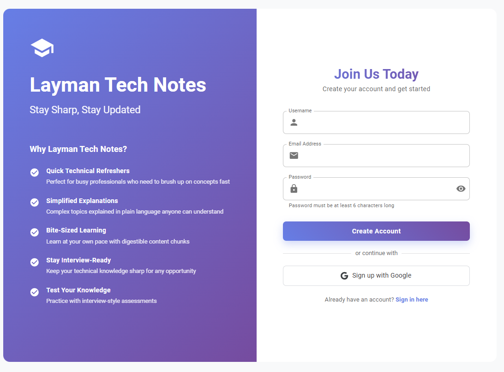
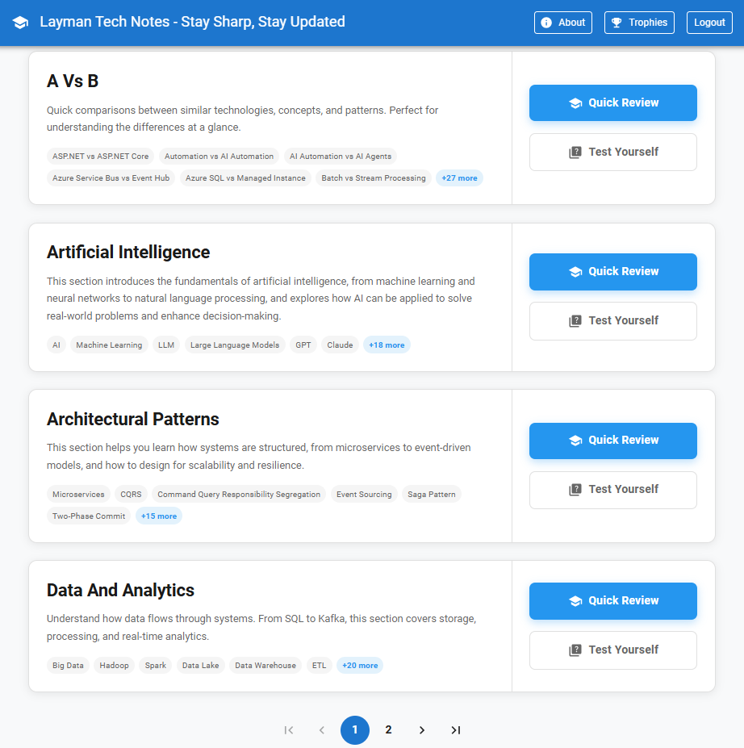
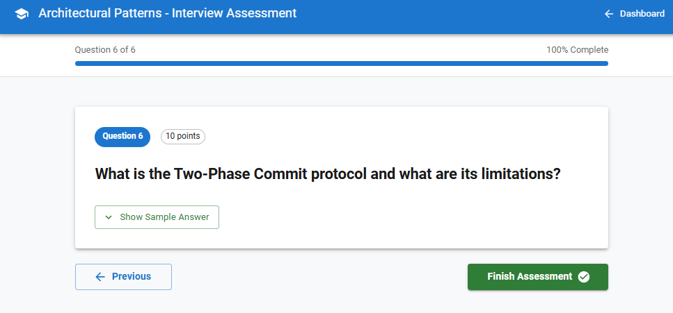
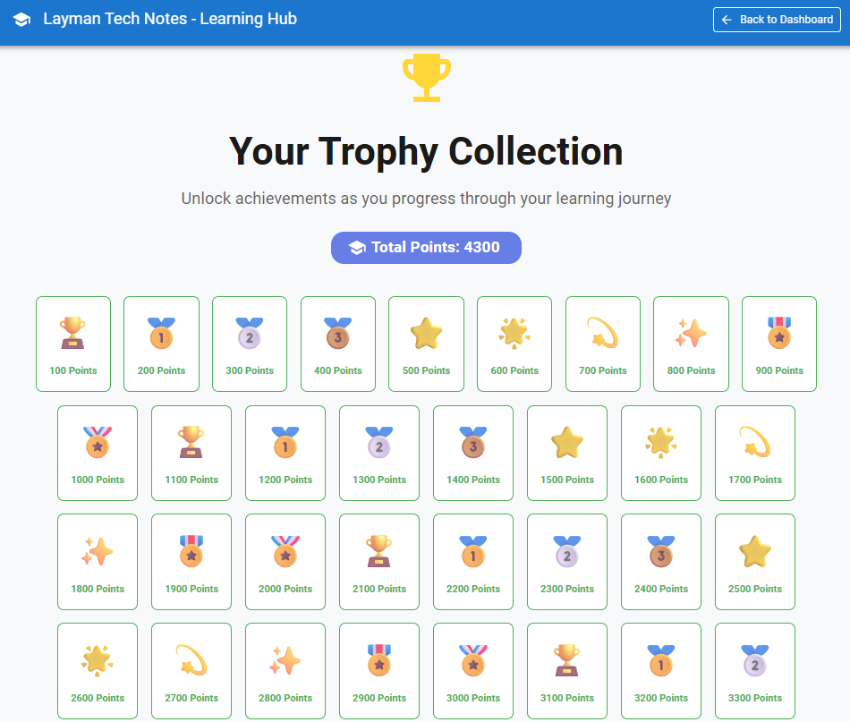

# Layman Tech Notes - Interactive Learning Platform

A modern React application designed to help busy tech professionals maintain and refresh their technical knowledge through simplified, bite-sized learning content.


---

##  Features

-  **Comprehensive Collection** covering essential tech topics
-  **Interview-Style Assessments** with hints and sample answers
-  **Gamification System** with 50 unlockable trophies
-  **Progress Tracking** with real-time points and achievements
-  **Fully Responsive** design for all devices
-  **Firebase Authentication** for secure user management
-  **Beautiful UI** built with Material-UI

---

## Screenshots




---

---




---



---


##  Quick Start

### Prerequisites

- Node.js (v14 or higher)
- npm or yarn
- Firebase account (free tier works)

### Installation

1. **Clone the repository**
   ```bash
   git clone https://github.com/yourusername/layman-technotes-react.git
   cd layman-technotes-react
   ```

2. **Install dependencies**
   ```bash
   npm install
   ```

3. **Configure Firebase**

   - Go to [Firebase Console](https://console.firebase.google.com/)
   - Create a new project
   - Enable **Authentication** (Email/Password)
   - Enable **Firestore Database** (Start in test mode)
   - Get your Firebase config

4. **Update Firebase Configuration**

   Open `src/firebase.js` and replace the config:

   ```javascript
   const firebaseConfig = {
     apiKey: "YOUR_API_KEY",
     authDomain: "YOUR_AUTH_DOMAIN",
     projectId: "YOUR_PROJECT_ID",
     storageBucket: "YOUR_STORAGE_BUCKET",
     messagingSenderId: "YOUR_MESSAGING_SENDER_ID",
     appId: "YOUR_APP_ID"
   };
   ```

5. **Start the development server**
   ```bash
   npm start
   ```

6. **Open your browser**
   ```
   http://localhost:3000
   ```

---

## 📁 Project Structure

```
layman-technotes-react/
├── public/
│   └── courses/                    # Course content
│       ├── a_vs_b/                 # A vs B Comparisons
│       ├── artificial_intelligence/ # AI Concepts
│       ├── architectural_patterns/  # Software Architecture
│       ├── data_and_analytics/     # Data Engineering
│       ├── design_principles/      # Design Patterns
│       ├── networking_security/    # Networking & Security
│       └── platform_knowledge/     # Platform Technologies
├── src/
│   ├── pages/
│   │   ├── Dashboard.jsx           # Main dashboard
│   │   ├── LearningPage.jsx        # Lesson viewer
│   │   ├── Assessment.jsx          # Interview assessments
│   │   ├── Trophies.jsx            # Trophy collection
│   │   ├── Signup.jsx              # User registration
│   │   └── signin.jsx              # User login
│   ├── firebase.js                 # Firebase config
│   └── App.js                      # Main app & routing
└── package.json
```

---


##  Configuration

### Firestore Security Rules

Set up basic security rules in Firebase Console:

```javascript
rules_version = '2';
service cloud.firestore {
  match /databases/{database}/documents {
    match /users/{userId} {
      allow read, write: if request.auth != null && request.auth.uid == userId;
    }
  }
}
```

### Environment Variables (Optional)

Create `.env` file for environment-specific config:

```bash
REACT_APP_FIREBASE_API_KEY=your_api_key
REACT_APP_FIREBASE_AUTH_DOMAIN=your_auth_domain
REACT_APP_FIREBASE_PROJECT_ID=your_project_id
```

Then update `firebase.js`:

```javascript
const firebaseConfig = {
  apiKey: process.env.REACT_APP_FIREBASE_API_KEY,
  authDomain: process.env.REACT_APP_FIREBASE_AUTH_DOMAIN,
  // ... rest of config
};
```

---

##  Adding New Content

### Add a New Course

1. Create course folder in `public/courses/your_course_name/`

2. Create `lessons-manifest.json`:
   ```json
   {
     "courseId": "your_course_name",
     "courseTitle": "Your Course Title",
     "flatStructure": true,
     "lessons": [
       {
         "lessonId": "lesson-001",
         "lessonTitle": "First Lesson",
         "duration": "5 min",
         "mdFiles": ["first-lesson.md"]
       }
     ]
   }
   ```

3. Create `assessment.json`:
   ```json
   {
     "courseId": "your_course_name",
     "courseTitle": "Your Course Title",
     "assessmentTitle": "Your Assessment Title",
     "passingScore": 70,
     "questions": [
       {
         "id": 1,
         "question": "Your question?",
         "hint": "Helpful hint",
         "sampleAnswer": "Detailed answer",
         "points": 10
       }
     ]
   }
   ```

4. Create lesson markdown files in `lessons/` folder

5. Update `src/pages/Dashboard.jsx` to include your course in the discovery list

---

##  Built With

- **[React](https://reactjs.org/)** - Frontend framework
- **[Material-UI](https://mui.com/)** - UI component library
- **[Firebase](https://firebase.google.com/)** - Authentication & Database
- **[React Router](https://reactrouter.com/)** - Navigation
- **[React Markdown](https://github.com/remarkjs/react-markdown)** - Markdown rendering
- **[React Syntax Highlighter](https://github.com/react-syntax-highlighter/react-syntax-highlighter)** - Code highlighting

---


##  Contributing

Contributions are welcome! Please follow these steps:

1. Fork the repository
2. Create a feature branch (`git checkout -b feature/AmazingFeature`)
3. Commit your changes (`git commit -m 'Add some AmazingFeature'`)
4. Push to the branch (`git push origin feature/AmazingFeature`)
5. Open a Pull Request

---

##  License

This project is licensed under the MIT License - see the [LICENSE](LICENSE) file for details.

---

##  Author

**Deepak Kumpala**

*"I believe in leading by example and making sure technical issues must be balanced with the needs of customers and the organizational interest."*

---

##  Acknowledgments

- React team for the amazing framework
- Material-UI for beautiful components
- Firebase for backend infrastructure

---

##  Support

For issues and questions:
- Open an issue on GitHub
- Check existing issues for solutions
- Review the [PROJECT_OVERVIEW.md](PROJECT_OVERVIEW.md) for detailed documentation

---

## 🌟 Star This Repository

If you find this project helpful, please consider giving it a star! ⭐

---

**Made with ❤️ for knowledge seekers everywhere**
